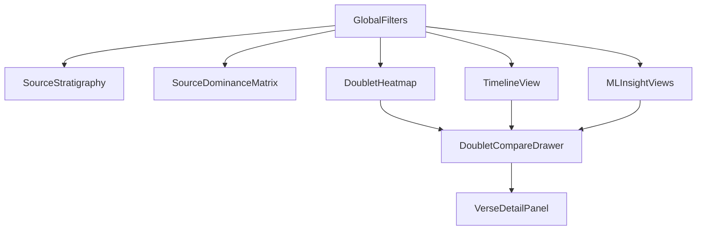

# Visualization Implementation Playbook

This playbook implements the approved deep-dive plan with concrete artifacts for execution.

## 1) PRD Feature to View Mapping

| PRD feature | Visualization pattern | Primary endpoint(s) | Required payload fields | Interaction model |
|---|---|---|---|---|
| Source Stratigraphy Map | Stacked area chart over canonical progression | `/api/v1/bird-eye/source-stratigraphy` | `data[].book`, `data[].chapter`, `data[].source_percentages`, `sources` | Global filters (book, source), brush zoom, chapter drilldown |
| Source Flow Network | Hybrid force-graph + Sankey | `/api/v1/bird-eye/source-flow-network` | `nodes`, `edges`, source weights, transition totals | Hover path highlight, source pair filtering, click-through to related verses |
| Doublet Distribution Heatmap | Matrix heatmap (book x chapter) + detail drawer | `/api/v1/bird-eye/doublet-heatmap` | `heatmap[].book`, `heatmap[].chapter`, `heatmap[].doublet_count`, `heatmap[].source_composition`, `heatmap[].doublets` | Cell click opens chapter-level doublet list, category filter, linked selection |
| Source Dominance Matrix | Dense source-by-book matrix with counts + percentages | `/api/v1/bird-eye/source-dominance-matrix` | `matrix[].book`, `matrix[].J/E/P/D/R`, `matrix[].*_count`, `matrix[].total_verses` | Source sorting, row/column focus, compare mode |
| Interactive Source Timeline | Multi-track timeline with event markers | `/api/v1/bird-eye/timeline`, `/api/v1/doublets/timeline`, `/api/v1/doublets/source-contribution-timeline` | `timeline[]` or `timeline_events[]`, source contribution objects, canonical order | Zoom tiers, event focus, source overlay toggles |
| Doublet Comparison Dashboard | Side-by-side synchronized readers + diff rail | `/api/v1/doublets/compare` | `passages[]`, `differences[]`, source/category/theme metadata | Word-level diff hover, synchronize scroll, passage pinning |
| AI Pattern Discovery Views | Embedding scatter + similarity graph + feature bars | `/api/v1/ml/embedding-projection`, `/api/v1/ml/similarity-network`, `/api/v1/ml/feature-analysis` | projection points, graph nodes/edges, feature vectors | Selection linking across views, threshold sliders, source grouping |

## 2) Visualization Tool Selection Matrix

| Use case | Primary tool | Fallback tool | Why primary | Fallback trigger |
|---|---|---|---|---|
| Stratigraphy + heatmaps + matrices | Apache ECharts | Plotly | Best performance for dense, linked 2D analytical views and brushing | If team wants Python-first rendering and faster one-off chart generation |
| Relationship networks (large) | Sigma.js + Graphology | Cytoscape.js | Better scaling for larger node/edge sets and progressive rendering | If current Cytoscape experience is already adequate for target scale |
| Existing network assets | Cytoscape.js | Sigma.js | Already in project with generated data and scripts | If interaction FPS drops with larger graph expansion |
| Research storytelling notebooks | Observable Plot/Framework | Vega-Lite | Fast for interactive narrative explanations and publishable notebooks | If team prefers strict JSON spec and typed chart grammar |
| Declarative reproducible charts | Vega-Lite/Altair | ECharts | Strong schema consistency and reusable specs for research artifacts | If advanced interaction/performance features are needed beyond declarative scope |
| Internal KPI dashboards | Metabase | Superset | Simpler setup for non-dev exploration | If deeper custom SQL/data model controls are required |
| Geography expansion | deck.gl | ECharts geo | High-performance map layers and animation support | If geographic requirements remain lightweight |

## 3) Bird's Eye Dashboard Blueprint

### 3.1 Layout

- Top bar: corpus scope, source toggles (J/E/P/D/R), chapter range, category filter, reset/export.
- Left rail: navigation between Core Views, Doublets, ML Insights, and Saved Perspectives.
- Main canvas:
  - Row 1: Source Stratigraphy (wide), Source Dominance Matrix (narrow).
  - Row 2: Doublet Heatmap (wide), Doublet Comparison Drawer (collapsible).
  - Row 3: Source Flow Network + Timeline split view.
  - Row 4: ML Embedding Projection + Similarity Network + Feature Analysis.
- Right rail: contextual details panel (selected chapter, selected doublet, selected cluster).

### 3.2 Linked Interaction Rules

1. Any source toggle updates all visible views.
2. Selecting a heatmap cell applies `book + chapter` context to timeline and verse detail.
3. Selecting a network node filters comparison drawer to related doublet passages.
4. Selecting an embedding cluster filters similarity network and feature-analysis group stats.
5. Global reset restores canonical order and clears all local selections.

### 3.3 Drilldown Rules

- Book-level click -> chapter-level stratigraphy and heatmap focus.
- Chapter-level click -> verse list via `/api/v1/verses/by-chapter`.
- Doublet item click -> side-by-side compare via `/api/v1/doublets/compare`.
- Timeline event click -> source contribution detail from `/api/v1/doublets/source-contribution-timeline`.
- ML point click -> related passages and source profile chips.

## 4) Data Contract Checklist (Current API)

### 4.1 Core Bird-Eye Contracts

- `/api/v1/bird-eye/source-stratigraphy`
  - Required: chapter sequence, source percentages, verse counts.
  - Status: usable now.
  - Gap: `chapter_range` accepted but not actively applied in aggregation logic.

- `/api/v1/bird-eye/source-flow-network`
  - Required: weighted transitions between sources, optional book partitioning.
  - Status: usable now using existing doublet flow payload.
  - Gap: add explicit schema docs for `nodes/edges` shape in API reference.

- `/api/v1/bird-eye/doublet-heatmap`
  - Required: chapter matrix values and embedded doublet references.
  - Status: usable now.
  - Gap: include normalized complexity score to support richer color scaling.

- `/api/v1/bird-eye/source-dominance-matrix`
  - Required: source percentages and absolute counts by book.
  - Status: usable now.
  - Gap: add optional canonical sort mode metadata for UI consistency.

- `/api/v1/bird-eye/timeline`
  - Required: timeline points and source tracks.
  - Status: partially usable.
  - Gap: `approximate_date`/period values are placeholders; add real chronology mapping table.

### 4.2 Doublet and ML Contracts

- `/api/v1/doublets/compare`
  - Status: usable; includes passages and word-level differences.
  - Gap: optional token offsets for precise diff highlighting.

- `/api/v1/doublets/timeline` and `/api/v1/doublets/source-contribution-timeline`
  - Status: usable; includes canonical ordering and grouped events.
  - Gap: unify timeline event shape for one frontend timeline adapter.

- `/api/v1/ml/embedding-projection`
  - Status: usable with `tsne` and optional `umap`.
  - Gap: expose deterministic cache key for reproducible session reuse.

- `/api/v1/ml/similarity-network`
  - Status: usable; threshold and edge caps supported.
  - Gap: include precomputed layout coordinates to reduce client startup cost.

- `/api/v1/ml/feature-analysis`
  - Status: usable for grouped source/feature comparisons.
  - Gap: add feature taxonomy metadata so labels are UI-safe and stable.

## 5) Two-Week Prototype Sequence

### Week 1 (Quick Value)

1. Build Bird-Eye shell with global filters and routing.
2. Implement Stratigraphy + Dominance Matrix (ECharts).
3. Implement Doublet Heatmap with chapter click-to-detail.
4. Wire Doublet Comparison drawer to `/api/v1/doublets/compare`.

### Week 2 (Differentiation)

1. Implement Source Flow Network (keep Cytoscape path first, Sigma path optional).
2. Implement Timeline with contribution overlay from source-contribution timeline endpoint.
3. Add ML Insights tab (embedding projection + similarity network + feature panel).
4. Add export presets and saved view-state snapshots.

## 6) Definition of Done for This Phase

- Each PRD core visualization has one implemented primary chart and one documented fallback.
- Linked interactions work across at least stratigraphy, heatmap, timeline, and comparison drawer.
- All listed endpoints are integrated with explicit adapter contracts in the frontend layer.
- Team can demo end-to-end flow: global filter -> chapter drilldown -> doublet compare -> ML context.
